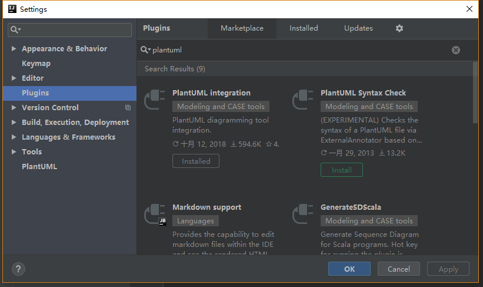
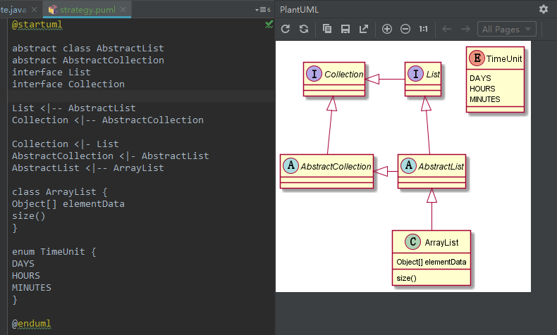
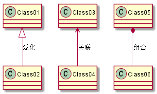
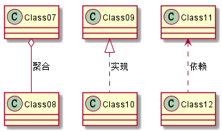

# 设计模式（1）——工具篇

曾经信心满满的立过很多flag，要学习并掌握某一领域或坚持某件事儿，最终都无疾而终，只剩下零星概念和一堆遗憾，原因大都类似：
- 计划被其它事情打断，中止了
- 进行到一半，发现意义不大
- 进行中遇到了困难，放弃了
- 当时掌握了，但没有及时总结，后续没有练习，忘记了

包括不限于协议栈、数据库、JVM、正则表达式、音律、写总结......也包括设计模式。结果一回头，猛然发现时间已经过去了这么久，却什么都没有留下来。

在此再立一个flag，每周写一篇总结。周积跬步，以致千里。

## UML

> 统一建模语言 ([Unified Modeling Language, UML](https://baike.baidu.com/item/%E7%BB%9F%E4%B8%80%E5%BB%BA%E6%A8%A1%E8%AF%AD%E8%A8%80/3160571?fromtitle=UML&fromid=446747&fr=aladdin))

所有介绍设计模式的资料都会用到uml图。之前总以为UML图就是类图，每次都是被继承，实现里面的实线、虚线、箭头等给整懵了。然后就放弃看图，只看代码实现。

现在才知道，类图只是UML中的一小部分。UML图还包括用例图，时序图等。和SE等大佬交流时，设计文档里全是各种UML图。

## PlantUML

各种工具都可以画UML图，包括visio，Visual Paradigm等。我们使用PlantUML, 像Markdown一样，通过简单的语句*写UML图*，使用方便。当然，这一套工具也都是免费的。

### windows安装
- PlantUML

PlantUML有IntelliJ IDEA的插件版，可以直接在IDEA的plugins中下载安装。我们也使用这个版本。



插件装好之后，新建puml文件，直接打开就可以看到对应的编辑器了。



- Graphviz

安装插件之后，也可能无法看到右边的预览图，而是提示报错，这是因为缺少Graphviz环境变量。Graphviz是一个开源的绘图软件，很多开源软件生成可视化图时都使用Graphviz。

 [下载Graphviz](http://www.graphviz.org/download/)并安装后，配置如下环境变量之后就好了。

 ```bash
 GRAPHVIZ_DOT=D:\Program Files (x86)\Graphviz2.38\bin\dot.exe
 ```

 ## PlantUML基本语法
 
 > [PlantUML类图](https://yq.aliyun.com/articles/25405)

- 泛化，Generalization
- 关联，Association
- 组合，Composition
- 聚合，Aggregation
- 实现，Realization
- 依赖，Dependency


```
@startuml
Class01 <|-- Class02:泛化
Class03 <--  Class04:关联
Class05 *--  Class06:组合
Class07 o--  Class08:聚合
Class09 <|.. Class10:实现
Class11 <..  Class12:依赖
@enduml
```



