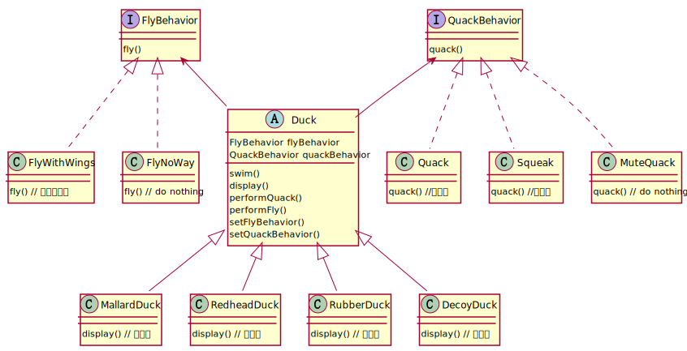

> 策略模式定义了算法族，分别封装起来，让它们之间可以相互替换，此模式让算法的变化独立于使用算法的客户。

# 类图



# 继承 vs 组合

上面的描述有些抽象。策略模式想要表达的是，如果一个类需要某种行为，不要通过继承来实现（is-a），可以使用组合（has-a）来实现。这样做更加灵活，当业务类（duck）的行为（fly）需要改变时，只需要注入不同的算法实现类即可。

这也就是 **鸭子继承**， 如果一个类通过组合获取了鸭子的行为，那它就可以当作鸭子使用，不需要关注它是否继承自鸭子基类，是否真正的是一只鸭子。

Java中Spring的依赖注入（DI）也是这种思路。Golang中甚至取消了继承，从语法层面避免继承所带来的耦合。这里甚至可以推测，OOP在提出之初，只是基于对真实世界中对象建模的思路，提出了继承，实现等概念。但后续工程实践发现继承并没有组合好用。

很多协议设计也是这样，基于最初的构想设计了很多特性，结果后续使用中发现一部分设计很鸡肋或很容易出错。于是又通过各种约定，最佳实践，框架等来解决这些问题。

# 代码
```java
public interface FlyBehavior {
    void fly();
}

class FlyWithWings implements FlyBehavior {
    @Override
    public void fly() {
        // todo 
    }
}

class FlyNoWay implements FlyBehavior {
    @Override
    public void fly() {
        // do nothing
    }
}

public interface QuackBehavior {
    void quack();
}

class Quack implements QuackBehavior {
    @Override
    public void quack() {
        // todo 
    }
}

class Squeak implements QuackBehavior {
    @Override
    public void quack() {
        // todo
    }
}

class MuteQuack implements QuackBehavior {
    @Override
    public void quack() {
        // todo
    }
}

public abstract class Duck {
    FlyBehavior flyBehavior;
    QuackBehavior quackBehavior;

    abstract void display();

    void performFly() {
        flyBehavior.fly();
    }

    void performQuack() {
        quackBehavior.quack();
    }

    void setFlyBehavior(FlyBehavior fb) {
        flyBehavior = fb;
    }

    void setQuackBehavior(QuackBehavior qb) {
        quackBehavior = qb;
    }
}

class ModelDuck extends Duck {

    public ModelDuck() {
        flyBehavior = new FlyNoWay();
        quackBehavior = new Quack();
    }

    @Override
    void display() {
        // todo 
    }
}
```