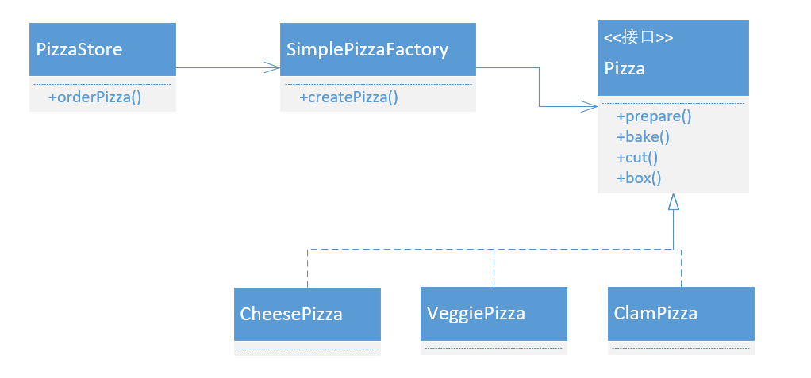
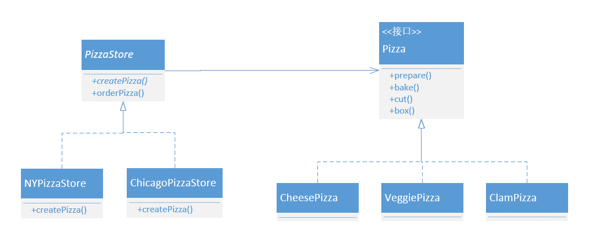

> 工厂模式定义了一个创建对象的接口，但由子类决定要实例化的类时哪一个。工厂方法让类把实例化推迟到子类。

# 简单工厂

简单工厂的思路也确实非常简单，就像将创建类的代码进行了简单的抽离。《设计模式》也说这不应该算一种模式，更像一种编程习惯。就好比撸完代码之后自己回头看看，发现这一块独立的逻辑可以抽离出来独立一下。

# 工厂模式

工厂模式中，创建者与产品为平行类层级，只是创建者的创建方法产生产品。要创建哪种产品，由具体的创建者子类决定；产品的实际创建，也由产品的具体实现类完成。

# 代码

略
