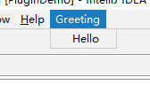

最近想试着开发一个IDEA的插件，**[官方指导](http://www.jetbrains.org/intellij/sdk/docs/basics/getting_started.html)** 中有两种方式:

- 使用Gradle
- 使用DevKit

而且官方推荐Gradle的方式，称DevKit的工作流已经过时了。但百度出来的全都是DevKit的方式。而且Android Studio也是gradle，那就试试gradle的方式开发一个插件。

# Gradle配置

使用gradle创建工程之后，需要下载一些文件，因为GWF的原因这一步会特别慢，不使用VPN基本都失败了。网上找了使用aliyun源的方式，搞定了这一步。

## 单个工程修改

将工程下```build.gradle```中的```repositories```替换为如下内容

```bash
repositories {
    maven { url 'https://maven.aliyun.com/repository/public/' }
    maven { url 'https://maven.aliyun.com/repository/google/' }
    maven { url 'https://maven.aliyun.com/repository/jcenter' }
}
```

具体替换地址可以看[aliyun官网](https://maven.aliyun.com/mvn/view)的地址，网上大多数配置都没有更新，使用的还是旧地址。

## 全局配置

以上方式只修改单个工程的，每次新建工程都要修改，很麻烦。下面这个方法可以修改全局的配置。

在 ```C:\Users\用户名\.gradle```目录下创建```init.gradle```文件，内容如下：

```bash
allprojects {
    repositories {
        maven { url 'https://maven.aliyun.com/repository/public/' }
        maven { url 'https://maven.aliyun.com/repository/google/' }
        maven { url 'https://maven.aliyun.com/repository/jcenter' }

        all { ArtifactRepository repo ->
            if (repo instanceof MavenArtifactRepository) {
                def url = repo.url.toString()

                if (url.startsWith('https://repo.maven.apache.org/maven2/') || url.startsWith('https://repo.maven.org/maven2') 
                    || url.startsWith('https://repo1.maven.org/maven2') || url.startsWith('https://jcenter.bintray.com/')
                    || url.startsWith('https://maven.google.com/') || url.startsWith('https://dl.google.com/dl/android/maven2/')) {
                    //project.logger.lifecycle "Repository ${repo.url} replaced by $REPOSITORY_URL."
                    remove repo
                }
            }
        }
    }

    buildscript {
        repositories {
            maven{ url 'https://maven.aliyun.com/repository/public/'}
            maven{ url 'https://maven.aliyun.com/repository/google/'}
            maven{ url 'https://maven.aliyun.com/repository/jcenter'}

            all { ArtifactRepository repo ->
                if (repo instanceof MavenArtifactRepository) {
                    def url = repo.url.toString()
                    if (url.startsWith('https://repo1.maven.org/maven2') || url.startsWith('https://jcenter.bintray.com/')
                         || url.startsWith('https://dl.google.com/dl/android/maven2/')) {
                        //project.logger.lifecycle "Repository ${repo.url} replaced by $REPOSITORY_URL."
                        remove repo
                    }
                }
            }
        }
    }
}
```

可以看到，思路就是在自动添加aliyun地址，然后删掉默认的repo地址。

## 下载IDEA-sources.jar

以上两个配置之后，会很快的下载好gradle相关的依赖，但开发IDEA插件，会从jetbrains官网下载```ideaIC-2018.3.5-sources.jar```文件，估计是和插件调试有关。这个文件aliyun肯定不会有，下载巨慢。

解决方法就是手动下载好，放在如下临时目录下

```bash
C:\Users\用户名\.gradle\caches\modules-2\files-2.1\com.jetbrains.intellij.idea\ideaIC\2018.3.5\临时目录\
```

具体文件和路径与IDEA版本相关。

放置之后，重启IDEA就好了。

## 使用gradle开发插件

配置好gradle之后，按照官网的指导开发一个Hello World。点击运行之后，会打开一个新的IDEA窗口，随便选择一个项目进入之后，就可以看到效果了。如下：




