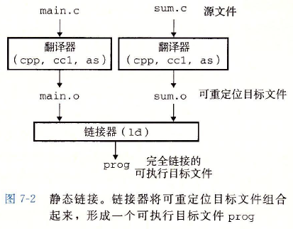
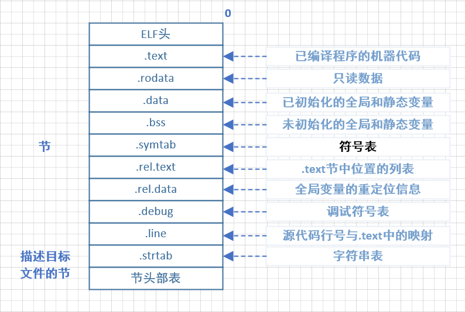
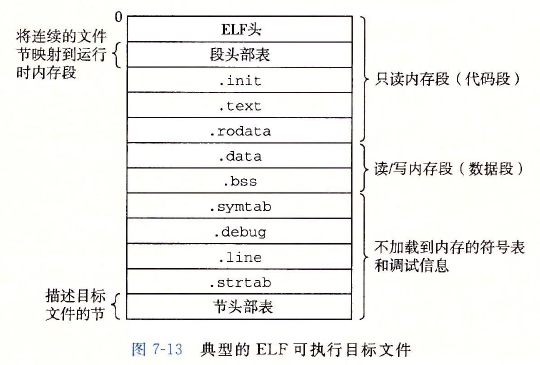

## 编译流程


编译生成可重定位目标文件，经链接器将其和依赖的库组合起来，生成可执行文件。

可执行文件运行时，经过```加载器(loader)```将其中的代码和和数据拷贝到内存，然后跳转到程序起始地址开始执行。



## 链接

连接器主要完成2个任务

- 符号解析：每个符号对应一个函数，全局变量或静态变量。符号解析将符号引用与符号定义关联起来。
- 重定位：编译器生成的可重定位目标文件中地址从0开始。链接器把多个库合并，将符号与内存地址关联，重定位这些节，并修改符号引用地址。

### ELF文件

> 可执行可链接格式ELF(Executable and Linkable Format) 


<center>可重定位目标文件</center>


<center>可执行目标文件</center>

### 静态库与静态链接

linux上静态库以```存档（archive, .a后缀）```文件格式存储，是一组可重定位目标文件的集合。

静态链接时，会将```.a```中对应的内容拷贝，最终生成的可执行文件中包含静态库内容。程序运行时不再依赖静态库。

### 动态共享库与动态链接

- 静态库内容需要拷贝到可执行文件中，生成目标文件比较大，占用空间（减少了运行时依赖，现在看也许是优势）
- 静态库不支持热更新

相比静态库，以上就是动态库的特点：允许多个进程在内存中共享同一份库代码。

#### 位置无关代码

> 位置无关代码PIC(Position-Independent Code), 编译时需要指定```-fpic```参数

#### 显示调用

显示使用共享库时不需要依赖头文件，通过```dlfcn.h```中提供的API进行调用：

```c
// 将动态库加载到内存
// 指定名称，在LD_LIBRARY_PATH、/lib、/usr/lib目录下查找
// 或指定全路径
void *dlopen(const char *libname,int flag);

// 在动态库中查找对应函数
void *dlsym(void *handle,const char *symbol);

// 
dlclose()

// 获取最近一次error信息，调用后会清空最近的错误信息
char *dlerror(void);
```

显示调用，可以在运行时打开库函数进行调用，有点儿类似动态语言的效果；而且，在代码执行到```dlopen```之前，```so```可以不存在。

#### 隐式调用

隐式调用时需要引用库对应的头文件，代码中直接调用头文件中声明的函数即可；编译时，通过```-l```指定需要链接的库。

但隐式调用，在可执行文件开始执行时，所有依赖的库必须存在，否则无法运行。
