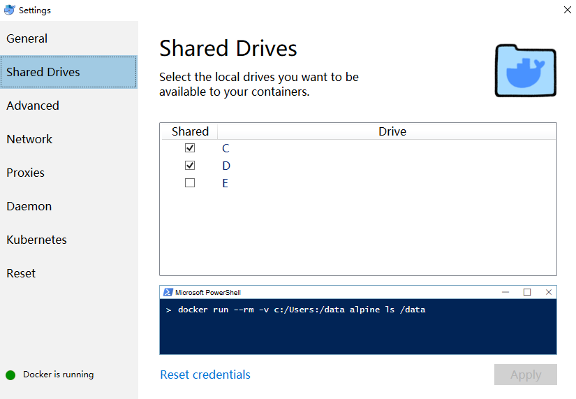

build 2019 微软发布了wsl2和vscode remote插件。前者使用了真正的linux内核，解决了wsl的很多问题，据说可以直接运行docker。wsl2在20H1的快速预览版18917已经可以使用。VS code remote是vscode的一组插件，包括remote ssh， remote wsl和remote container，VS code升级到1.35.1之后就可以使用了。今天我们尝试一下VS code remote的配置。

首先在VS code的Extensions中安装所有的remote插件。然后按照下方官方说明进行安装配置，这里就不多说了。

[VS Code Remote Development](https://code.visualstudio.com/docs/remote/remote-overview)

下面主要说一下踩到的坑。

## remote ssh & remote wsl

remote插件机制都类似，安装时会在remote虚拟机/WSl/容器内安装```vscode server```，由server端实际运行，本地VS code只作为界面显示。

1 remote ssh 免密登录

官方配置指导为将本地ssh公钥加入服务端信任列表中，ssh登录时可以免密登录。这里遇到的一个坑是，所有配置都正确，但ssh时总是不成功。后来发现使用的服务器之前已经配置过多次ssh免密登录了，被限制了。换了一个vm就成功了。这应该是ssh的一个限制，网上找了一个解决方法，但实测没有生效，这里就不说了。

还有一种解决方法是配置```"remote.SSH.showLoginTerminal": true```使用密码登录。但这样需要多次账号密码，略麻烦。

2 下载vs code server

第一次打开remote ssh时连接的服务端需要下载vs code server， 所以需要使用的vm能够访问外网。在某些网络环境下可能需要使用vpn。

3 证书认证失败

wget下载使用https地址。使用vpn时，有些vpn会拦截替换证书。但是vm本身没有添加私有ca导致无法认证ms的证书。这里有以下3个解决方法：

- 找到下载脚本，在wget后面添加```--no-check-certificate```

remote wsl我就是这样子解决的，但remote ssh没有找到对应的脚本，无法修改。

- 将vpn的私有ca添加到os中

使用浏览器访问https地址，可以拿到ca证书。将ca证书导出，ubuntu需要导成pem(base64)格式。导出的文件后缀名为```cer```, 直接手动修改为```crt```后缀。然后把证书放入```/usr/local/share/ca-certificates/```目录下，并执行如下命令:

```bash
sudo update-ca-certificates
```

- 修改wget全局配置

在```~/.wgetrc```中添加如下配置，修改wget全局配置，不校验对端证书。当然需要自己把握风险。

```bash
check-certificate=off
```

## remote container

我是win10系统，安装了docker-for-windows。使用的是官方给的[vscode-remote-try-cpp](https://github.com/Microsoft/vscode-remote-try-cpp)例子。

remote container会根据Dockerfile去```docker.io```下载```debian```基础镜像，然后apt安装```build-essential```等编译工具。

- 下载基础镜像

国内访问```docker.io```总是失败。这个可以使用各种各样的镜像加速器解决，比如[阿里云的镜像加速器](https://cr.console.aliyun.com/#/imageList)。申请账户之后按照指导配置就可以了，免费使用，很好使。

- 编译工具下载慢

Dockerfile中会下载编译工具，这时候使用的软件源为```debian9```基础镜像中默认的软件源，这个源可以访问，但是特别慢。

1 一种思路是删掉Dockerfile中apt安装编译工具的步骤，先让镜像跑起来，这时候已经可以使用remote docker了。然后再在容器内修改apt软件源为国内源，再手动安装gcc等编译工具。但是容器文件系统的缘故，容器内写文件性能很差，多次操作会导致多个镜像层。

2 在Dockerfile中直接修改apt软件源，并与apt下载编译工具合并为一个```RUN```语句， 如下是我修改后的Dockerfile，使用aliyun软件源，其它环境也可以参考：

```Dockerfile
#-------------------------------------------------------------------------------------------------------------
# Copyright (c) Microsoft Corporation. All rights reserved.
# Licensed under the MIT License. See https://go.microsoft.com/fwlink/?linkid=2090316 for license information.
#-------------------------------------------------------------------------------------------------------------

FROM debian:9

# Avoid warnings by switching to noninteractive
ENV DEBIAN_FRONTEND=noninteractive

RUN echo 'deb http://mirrors.aliyun.com/debian/ stretch main non-free contrib\n \
	deb-src http://mirrors.aliyun.com/debian/ stretch main non-free contrib\n \
	deb http://mirrors.aliyun.com/debian-security stretch/updates main\n \
	deb-src http://mirrors.aliyun.com/debian-security stretch/updates main\n \
	deb http://mirrors.aliyun.com/debian/ stretch-updates main non-free contrib\n \
	deb-src http://mirrors.aliyun.com/debian/ stretch-updates main non-free contrib\n \
	deb http://mirrors.aliyun.com/debian/ stretch-backports main non-free contrib\n \
	deb-src http://mirrors.aliyun.com/debian/ stretch-backports main non-free contrib' > /etc/apt/sources.list \
	&& apt-get update \
    && apt-get -y install --no-install-recommends apt-utils 2>&1 \
    # 
    # Verify git, process tools, lsb-release (useful for CLI installs) installed
    && apt-get -y install git procps lsb-release \
    #
    # Install C++ tools
    && apt-get -y install build-essential cmake cppcheck valgrind \
    #
    # Clean up
    && apt-get autoremove -y \
    && apt-get clean -y \
    && rm -rf /var/lib/apt/lists/*

# Switch back to dialog for any ad-hoc use of apt-get
ENV DEBIAN_FRONTEND=dialog
```

3 启动时文件挂卷问题

需要修改docker配置，进行挂卷。我把c盘和d盘都挂卷了，就解决了这个问题，也没有深究具体是那个盘的问题。


