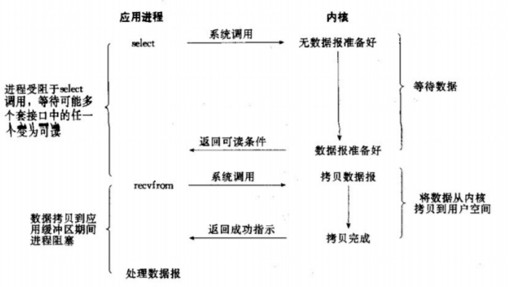

## I/O处理过程

### 系统调用

操作系统出于安全的考虑，将进程的内存空间划分为用户空间(0~3G)和内核空间(3-4G)。进程在执行用户自己的代码时处于用户态(ring3); 当用户代码需要操作系统资源时, 可以通过调用操作系统提供的标准接口(POSIX)进行访问, 此时进程从用户态切换到内核态. 操作系统提供的这些接口称为系统调用.

使用```top```命令时, Cpu后面的```us```就对应用户态使用的cpu, ```sy```就对应内核态使用的cpu.

```bash
%Cpu(s):  1.2 us,  0.7 sy,  0.0 ni, 98.0 id,  0.1 wa,  0.0 hi,  0.0 si,  0.0 st
```

硬盘, 网卡等等这些设备, 用户代码都是无法直接访问的, 需要通过操作系统提供的标准系统调用进行访问. 对于linux系统, 将所有的设备都抽象成文件, 因此, 对于这些设备的访问都可以归类为IO操作.

### 文件读取过程

用户程序读取磁盘或网卡上的数据, 执行read系统调用时可以分为2个过程:

1. 操作系统需要将磁盘或网卡上的数据先拷贝到内核缓冲区

2. 操作系统再将内核缓冲区的数据拷贝到用户缓冲区

### 内核缓冲区

我们知道, 硬盘等外设因为硬件原因, 读写相对内存来说是要慢几个数量级的. 如果内核一有数据就立即写入磁盘, 就需要频繁的调用驱动的硬件.操作系统为了提高与硬件交互的效率, 并不会一有数据就立即写入, 而是等攒够一些数据之后再批量写入.

因此, ```内核缓冲区时为了减少内核与外部硬件交互的次数```.

### 用户缓冲区

操作系统进行系统调用是有一定开销的, 而且相对开销很大. 回想读取文件时, 我们都会先申请一个buffer数组, 然后循环每次```read``` len大小的数据, 之后代码对buffer内容进行处理.

这么做的原因是为了避免频繁的进行系统调用. 关于len为什么取1024或4096, <<UNIX环境高级编程>>中专门有讨论, 这个取值是基于统计分析出来的最佳大小.

因此, ```用户缓冲区是为了减少系统调用次数```.

## I/O模型

<<UNIX网络编程>>中介绍了UNIX种5种I/O模型:

- 阻塞式I/O模型 (blocking)
- 非阻塞式I/O模型 (non-blocking)
- I/O复用模型 (I/O multiplexing)
- 信号驱动式I/O模型
- 异步I/O模型 (asynchronous I/O)

根据前面的描述可以知道, I/O操作涉及```网卡->内核缓冲区```及```内核缓冲区->用户缓冲区```两个过程, 下面先按照<<UNIX网络编程>>中的描述介绍各种模型.

### 阻塞式I/O模型 (blocking)

阻塞式I/O的操作流程如下:


从图中可以看到, 用户执行```recvfrom```时, 数据处理过程中的两个阶段用户线程都被阻塞. 在linux中，默认情况为阻塞式.

### 非阻塞式I/O模型 (non-blocking)

非阻塞式I/O的操作流程如下:


不同于阻塞式, 当内核数据未就绪时, ```recvfrom```会立即返回error, 并不会阻塞用户线程. 但这时就需要用户线程不停重试调用```recvfrom```, 直到内核数据ready之后, 内核执行第2阶段,将数据拷贝至用户缓冲区.

### I/O复用模型 (IO multiplexing)

对于阻塞和非阻塞式I/O模型, 我们默认用户代码只处理一个连接. 当存在多个连接时, 最简单的思路就是为每个链接启动一个线程, 这样也可以处理. 另一种思路就是使用一个用户线程监控多个文件描述符, 哪个文件描述符对应的内核缓冲区ready之后, 用户线程就处理哪个文件描述符对应的连接. 第2种思路就是I/O复用.



从图中可以看出, I/O在```recvfrom```前增加了```select```用于确定内核中哪个链接对应的文件描述符数据ready了.

同时因为I/O复用相比阻塞式I/O多增加了一次系统调用, 对于单个连接来说, 开销是变大了的. 但当链接数变多时, 阻塞式I/O需要增加线程; 而I/O复用模型中, 大量的连接复用了同一个线程减少了开销, 同时大量的线程也摊平了增加的```select```步骤带来的系统调用开销, 因此在大量连接场景, I/O复用模型性能更优.

### 信号驱动I/O


从图中可以看出, 信号驱动I/O使用信号解决了第1阶段阻塞.

### 异步I/O (Asynchronous I/O)

异步I/O由POSIX规范定义, 处理流程如下:


从图中可以看出, 异步I/O在数据处理的两个阶段中, 都不会阻塞用户线程.

## I/O 模型比较

这里```阻塞```和```异步```很容易迷惑人, 因为大家很自然的就会认为```非阻塞 = 异步```, ```阻塞 = 同步```. 但在I/O模型中并不是这样的, 根据POSIX中对异步I/O的定义:

```bash
A synchronous I/O operation causes the requesting process to be blocked until that I/O operation completes;
An asynchronous I/O operation does not cause the requesting process to be blocked;
```

数据处理的2个阶段中, 只要任意阶段会阻塞用户线程, 都不属于```asynchronous I/O```. 从上面介绍可以看出, 5种I/O模型中, 前4种都属于同步I/O.

### I/O复用

I/O多路复用模型在linux上的实现, 经历了```select```, ```poll```, ```epoll```的发展过程, 每一个实现都是为了解决前面实现的缺陷. 下图是epoll实现时对比poll的测试结果, 可以看到随着横轴连接数的增加, epoll很稳定, 与poll之间的差异越来越大.


[epoll patch](http://www.xmailserver.org/linux-patches/nio-improve.html)

正是因为epoll突出的性能, 涉及I/O操作的库和基础软件在linux上基本都使用epoll实现. 比如nginx, node, android中的looper, java中的nio等等.

### epoll和异步I/O

从前面的分析可知, I/O复用只是解决了避免因为第1阶段阻塞从而需要创建大量线程的问题, 而异步I/O则解决了2阶段阻塞问题. 那是否异步I/O相比epoll的性能更加优异呢?

其实, 异步I/O只是POSIX规范中描述的一种I/O模型, 并非实现. 在linux上, 目前还没有成熟的内核异步I/O实现, glibc提供了一个用户态的异步IO实现, 但据说也有很多bug. 但是在windows上, ```IOCP```是一个成熟的内核态异步IO实现, windows上的很多应用是基于IOCP实现的. 关于这个问题, stackoverflow上有一个回答:

```txt
There is a notify on ready model in Windows as well (select or WSAWaitForMultipleEvents), which you may have looked at before. It can't scale to large numbers of sockets, so it's not suitable for high-performance network applications.

Don't let that put you off - Windows and Linux are completely different operating systems. Something that doesn't scale well on one system may work very well on the other. This approach actually works very well on Linux, with performance comparable to IOCP on Windows.
```

### 协程

前面定性分析了I/O复用相比阻塞式I/O在大量连接时性能优异的原因, 是因为阻塞式IO需要为每个连接起一个线程, 维护大量的线程涉及大量的线程切换导致系统调度开销很大. 这也是为什么nginx相比Apache性能好的原因.

但如果将*线程*的开销降下来了呢？　golang中的server就是这种思路, 每个连接对应一个协程, 使用协程减少线程上下文切换的开销从而提升性能. 当然, 这只是协程使用的一种场景, 这种思路对应阻塞式IO, 编程模型更加简单. 目前还没有看到使用协程开发出的可以匹敌nginx性能的server, 估计也没有动力.
